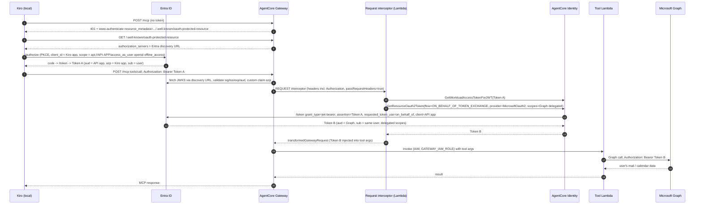

# Outlook via MCP for Kiro users: AgentCore Gateway + Lambda tools + Entra, delegated access

## Question

An organization wants to make Outlook available to their Kiro users via MCP. Constraints: local Kiro connects to the MCP endpoint; the MCP endpoint is AgentCore Gateway with Lambda tools; auth is Entra ID; only Kiro users may use it; access must be delegated (the user's own mailbox, not app-only). How do you implement this?

## Research Summary

The design has four moving parts. 

(1) **Kiro → Gateway**: Kiro's native remote-MCP OAuth client runs an authorization-code + PKCE flow against Entra with a pre-registered `clientId` (Entra has no dynamic client registration), obtaining a v2 access token whose `aud` is a dedicated Entra "API" app registration. 

(2) **Gateway inbound auth**: a `CUSTOM_JWT` authorizer with the Entra tenant discovery URL, `allowedAudience` = API app ID, plus a custom-claim check on `azp` = Kiro client app ID (Entra v2 tokens carry `azp`, not `client_id`, so `allowedClients` does not apply). 

(3) **Delegation into Lambda**: Lambda targets are IAM-only (`GATEWAY_IAM_ROLE`) and the Lambda only receives tool arguments plus gateway IDs in `client_context.custom`, so the inbound user token has to be carried across by a REQUEST interceptor with `passRequestHeaders: true`; the interceptor (or the tool Lambda) then exchanges it for a delegated Graph token via AgentCore Identity's on-behalf-of exchange (`MicrosoftOauth2` provider, `JWT_AUTHORIZATION_GRANT`, which maps to Entra's `jwt-bearer` + `requested_token_use=on_behalf_of`). 

(4) **"Only Kiro users"**: enforced at three layers: Entra enterprise-app "assignment required" on the Kiro client app (token issuance refused for non-assigned users), the Gateway `azp` claim check (only tokens minted for the Kiro client are accepted), and optionally Cedar policy on Entra `roles`/`groups` claims for per-tool differentiation. Kiro's enterprise MCP registry allow-list is a client-side complement.

A simpler variant exists if custom code is not needed: attach Microsoft Graph as an OpenAPI target with the `MicrosoftOauth2` credential provider in OBO mode and let the Gateway do the exchange itself (no Lambda, no interceptor). This is "Option A"; the Lambda design below is "Option B".

**Sources:**
- [Configure inbound JWT authorizer](https://docs.aws.amazon.com/bedrock-agentcore/latest/devguide/inbound-jwt-authorizer.html)
- [On-behalf-of token exchange with AgentCore Identity](https://docs.aws.amazon.com/bedrock-agentcore/latest/devguide/on-behalf-of-token-exchange.html)
- [Specify the authorization type and credentials to access the gateway target](https://docs.aws.amazon.com/bedrock-agentcore/latest/devguide/gateway-building-adding-targets-authorization.html)
- [AWS Lambda function targets](https://docs.aws.amazon.com/bedrock-agentcore/latest/devguide/gateway-add-target-lambda.html)
- [Types of interceptors](https://docs.aws.amazon.com/bedrock-agentcore/latest/devguide/gateway-interceptors-types.html)
- [Policy in AgentCore: Core concepts](https://docs.aws.amazon.com/bedrock-agentcore/latest/devguide/policy-core-concepts.html)
- [Blog: Building a secure auth code flow setup using AgentCore Gateway with MCP clients](https://aws.amazon.com/blogs/machine-learning/building-a-secure-auth-code-flow-setup-using-agentcore-gateway-with-mcp-clients/)
- [Blog: Apply fine-grained access control with Bedrock AgentCore Gateway interceptors](https://aws.amazon.com/blogs/machine-learning/apply-fine-grained-access-control-with-bedrock-agentcore-gateway-interceptors/)
- [Blog: Implement on-behalf-of token exchange for multi-tenant agents with AgentCore Gateway](https://aws.amazon.com/blogs/machine-learning/implement-on-behalf-of-token-exchange-for-multi-tenant-agents-with-amazon-bedrock-agentcore-gateway/)
- [Kiro docs: MCP configuration (OAuth section)](https://kiro.dev/docs/mcp/configuration/)
- [Kiro docs: Enterprise MCP governance](https://kiro.dev/docs/enterprise/governance/mcp/)
- [Microsoft: OAuth 2.0 On-Behalf-Of flow](https://learn.microsoft.com/en-us/entra/identity-platform/v2-oauth2-on-behalf-of-flow)
- [Microsoft: Entra does not publish an RFC 7591 registration endpoint](https://learn.microsoft.com/en-us/microsoft-365/copilot/extensibility/plugin-authentication-dynamic-client-registration)

## Detailed Findings

### Token flow (end to end)



Participants that must appear in any customer-facing diagram: the token issuer (Entra), the validator (Gateway calls back to Entra JWKS), and the exchange broker (AgentCore Identity calling Entra's token endpoint). Do not collapse the exchange into "Lambda calls Graph."

### 1. Entra ID: two app registrations

**API app ("Outlook MCP Gateway")** — the resource Kiro asks a token for, and the middle-tier client that performs OBO.
- Expose an API: scope `access_as_user` (Application ID URI `api://<api-app-id>`).
- Manifest: `requestedAccessTokenVersion: 2` so the access token is a v2 token with `iss = https://login.microsoftonline.com/<tenant>/v2.0`, matching the discovery URL the Gateway validates against. (Without this, Entra issues a v1-format token and issuer validation fails.)
- API permissions (delegated, not application): `Mail.Read` / `Mail.ReadWrite`, `Mail.Send`, `Calendars.Read` / `Calendars.ReadWrite`, `User.Read`. Grant admin consent so no per-user consent prompt is needed during OBO.
- Client credential (secret or, better, certificate) — stored only in the AgentCore Identity credential provider, never in Lambda env vars.
- `knownClientApplications`: add the Kiro client app ID (combined consent), or preauthorize the Kiro client for `access_as_user`.
- Optional: define app roles (e.g. `Outlook.Read`, `Outlook.ReadWrite`) if per-tool Cedar gating is wanted. Prefer app roles over the `groups` claim (groups overage above 200 drops the claim).

**Client app ("Kiro Outlook MCP client")** — what Kiro authenticates as.
- Public client, redirect URI `http://localhost:<port>/oauth/callback` (Kiro pins host to localhost/127.0.0.1, scheme http).
- API permission: `api://<api-app-id>/access_as_user` (delegated).
- Enterprise application: **Assignment required = Yes**, assign the Kiro users group. Entra then refuses to issue tokens to anyone else. This is the primary "only Kiro users" control.
- Conditional Access policies apply here as usual (device compliance, MFA), because the user signs in interactively.

Microsoft's OBO doc also allows a single-app variant (client and API in one registration) for a 1:1 pairing. Two apps is the cleaner default because the client stays a public client while the API holds the secret.

### 2. AgentCore Gateway: inbound authorizer

```json
{
  "authorizerType": "CUSTOM_JWT",
  "authorizerConfiguration": {
    "customJWTAuthorizer": {
      "discoveryUrl": "https://login.microsoftonline.com/<tenant-id>/v2.0/.well-known/openid-configuration",
      "allowedAudience": ["<api-app-id>"],
      "customClaims": [
        {
          "inboundTokenClaimName": "azp",
          "inboundTokenClaimValueType": "STRING",
          "authorizingClaimMatchValue": {
            "claimMatchValue": ["<kiro-client-app-id>"],
            "claimMatchOperator": "EQUALS"
          }
        }
      ]
    }
  }
}
```

- `allowedClients` validates the `client_id` claim. Entra v2 access tokens carry the calling app in `azp` (v1: `appid`), so use a custom claim on `azp` instead (same workaround the AWS blog documents for Okta's `cid`).
- `allowedAudience` must equal the API app's client ID (v2 tokens use the bare GUID as `aud`, not the `api://` URI; verify in a decoded test token). Pin `aud` so a token minted for any other resource is rejected.
- Optional `allowedScopes` cannot be used directly either: Entra puts delegated scopes in `scp`, not `scope`. Use a `customClaims` entry on `scp` if scope pinning is required.
- Gateway is "agnostic to how the token was obtained" (auth-code vs client-credentials). The `azp` check plus "assignment required" on the client app is what ensures a human Kiro user, not a service principal, is behind the token. App-only tokens are also rejected downstream: Entra OBO only works for user principals.

### 3. Getting the user's identity into the Lambda tools

Facts that shape the design:
- Lambda targets support only `credentialProviderType: GATEWAY_IAM_ROLE`; the Gateway's outbound OAuth/OBO credential providers do not apply to Lambda targets.
- The Lambda receives the tool arguments as the event and only `bedrockAgentCoreGatewayId`, `bedrockAgentCoreTargetId`, `bedrockAgentCoreToolName`, request/message IDs in `context.client_context.custom`. No token, no `sub`.
- REQUEST interceptors receive the inbound `Authorization` header when `passRequestHeaders: true`, and can rewrite the request body (`transformedGatewayRequest`) before the Gateway calls the target. The AWS interceptor blog uses exactly this to add an authorization token as a parameter for a downstream Lambda target, and recommends replacing the inbound JWT with a scoped-down downstream token rather than forwarding it as-is.

Recommended pattern (exchange in the interceptor, tool Lambda never sees Token A):
1. Create a workload identity for the interceptor and a `MicrosoftOauth2` OAuth2 credential provider in AgentCore Identity with the API app's client ID + secret/certificate and OBO mode `JWT_AUTHORIZATION_GRANT` (preconfigured for Microsoft; `requested_token_use=on_behalf_of` is added automatically).
2. Interceptor: read `Authorization` from `event.mcp.gatewayRequest.headers`, call `GetWorkloadAccessTokenForJWT(userToken=Token A)`, then `GetResourceOauth2Token(oauth2Flow=ON_BEHALF_OF_TOKEN_EXCHANGE, resourceCredentialProviderName=..., scopes=[Graph delegated scopes])`. AgentCore Identity performs the Entra OBO call and returns the Graph token (Token B). The client secret never leaves the AgentCore token vault.
3. Interceptor injects Token B (and optionally `sub`/`preferred_username` for logging) into `params.arguments` and returns `transformedGatewayRequest`. Only run this for `tools/call`; pass `tools/list`, `initialize`, etc. through unchanged. Return `transformedGatewayResponse` with a JSON-RPC error if the exchange fails (e.g. Entra `interaction_required` from Conditional Access).
4. Tool Lambda reads the injected token from the event and calls Graph (`/me/messages`, `/me/calendarView`, `/me/sendMail`) with `Authorization: Bearer <Token B>`. It cannot reach any other mailbox because Token B is delegated to that user.

Alternative: forward Token A and do the OBO inside each tool Lambda. Works, but spreads the inbound token and the exchange logic across every tool; only choose it if the interceptor's added latency per call is a problem.

Open check: whether the Gateway validates `tools/call` arguments against the target tool schema after interceptor rewriting. If it does, add an optional `_graphToken` (or similar) property to each tool's `inputSchema` in the target definition. Confirm in a test before finalizing the schema.

### 4. Outbound: Graph delegated permissions

Token B is a Graph token for the signed-in user with only the scopes the API app was consented for. Data scope is therefore per-user by construction; no policy is needed for mailbox isolation. Keep Graph permissions to the minimum the tools need (read-only first; add `Mail.Send` only if a send tool is in scope).

### 5. "Only Kiro users": layered controls

| Layer | Control | What it stops |
|-------|---------|---------------|
| Entra | Assignment required on the Kiro client enterprise app; assign the Kiro users group | Anyone not in the group gets no token at all |
| Entra | Conditional Access on the Kiro client app (compliant device, MFA) | Tokens from unmanaged devices |
| Gateway | `allowedAudience` = API app, custom claim `azp` = Kiro client | Tokens minted for another app or resource |
| Gateway (optional) | Cedar policy on `roles` claim, e.g. permit only `Outlook.ReadWrite` role for send/write tools; default-deny filters `tools/list` too | Per-tool differentiation (read-only pilot group) |
| Kiro (client-side) | Enterprise MCP registry allow-list in the Kiro profile (IAM Identity Center users only; client-enforced) | Users adding unvetted MCP servers |

Cedar example (principal tags come from the Entra token claims; check the auto-generated schema for exact tag names):

```cedar
permit(
  principal is AgentCore::OAuthUser,
  action == AgentCore::Action::"OutlookTools___send_mail",
  resource == AgentCore::Gateway::"arn:aws:bedrock-agentcore:<region>:<account>:gateway/<gateway-id>"
)
when {
  principal.hasTag("roles") && principal.getTag("roles") like "*Outlook.ReadWrite*"
};
```

Start the policy engine in `LOG_ONLY` mode and switch to `ENFORCE` after validating decisions in CloudWatch.

### 6. Kiro client configuration

Kiro remote MCP config (`~/.kiro/settings/mcp.json` or the enterprise registry):

```json
{
  "mcpServers": {
    "outlook": {
      "url": "https://<gateway-id>.gateway.bedrock-agentcore.<region>.amazonaws.com/mcp",
      "oauth": {
        "clientId": "<kiro-client-app-id>",
        "redirectUri": "http://localhost:7778/oauth/callback",
        "oauthScopes": ["openid", "profile", "offline_access", "api://<api-app-id>/access_as_user"]
      }
    }
  }
}
```

- `clientId` set → Kiro skips dynamic client registration and runs auth-code + PKCE as a public client. Required because Entra publishes no RFC 7591 registration endpoint.
- The `api://.../access_as_user` scope is what makes Entra issue an access token with `aud` = API app. Without it Kiro would receive a Graph-audience token that the Gateway cannot validate.
- Kiro validates the authorization server via RFC 8414 metadata and exact issuer matching. Entra serves OIDC discovery (`/.well-known/openid-configuration`), not `/.well-known/oauth-authorization-server`. Test the native Kiro flow first; if discovery fails, the AWS blog's fallback is the `mcp-remote` proxy with `--static-oauth-client-info` (experimental). Kiro IDE supports public clients only; the CLI also supports confidential clients, but the public-client design above avoids needing that.
- Token lifetime: Entra access tokens are ~1 h; `offline_access` yields a refresh token so Kiro refreshes silently. When refresh fails, Kiro re-triggers the browser flow mid-session.

### 7. Simpler alternative: no Lambda (Option A)

Attach Microsoft Graph as an OpenAPI target with the `MicrosoftOauth2` credential provider in OBO mode. The Gateway then exchanges Token A for Token B itself before calling Graph; no interceptor and no tool Lambda are needed. Choose Lambda tools (Option B) only when custom logic is required: response shaping/redaction, combining several Graph calls into one tool, or Entra-independent audit logging. Both options share the same Entra app registrations and inbound authorizer.

### 8. Verification checklist before handing to the customer

- Decode a real Kiro-acquired token and confirm `iss` ends in `/v2.0`, `aud` = API app GUID, `azp` = Kiro client GUID, `scp` contains `access_as_user`.
- Confirm Gateway 401 returns `www-authenticate: Bearer resource_metadata=...` and that Kiro completes the browser flow natively (otherwise `mcp-remote`).
- Confirm the interceptor receives `Authorization` (`passRequestHeaders: true`) and that `GetResourceOauth2Token` with `ON_BEHALF_OF_TOKEN_EXCHANGE` returns a Graph token (check `MicrosoftOauth2` provider config, admin consent on Graph scopes).
- Confirm rewritten `tools/call` arguments reach the tool Lambda (schema validation question above).
- Negative tests: unassigned Entra user (expect no token), token from a different client app (expect Gateway 401/403), app-only client-credentials token (expect Gateway reject via `azp` mismatch, and OBO would fail anyway).


## Recommended Answer

To give Kiro users delegated Outlook access through AgentCore Gateway with Lambda tools and Entra, set it up in four layers.

1. Entra: create two app registrations. An API app ("Outlook MCP Gateway") that exposes an `access_as_user` scope, requests v2 access tokens, holds the delegated Graph permissions (Mail.Read, Calendars.Read, and so on) with admin consent, and owns a client secret or certificate. A public client app ("Kiro Outlook MCP client") with a `http://localhost:<port>/oauth/callback` redirect URI and permission to `access_as_user`. On the client app's enterprise application, set "Assignment required" and assign the Kiro users group; that alone stops anyone else from obtaining a token.

2. Gateway inbound auth: a CUSTOM_JWT authorizer with the tenant's v2.0 OIDC discovery URL, `allowedAudience` = API app ID, and a custom claim check `azp` = Kiro client app ID (Entra puts the client in `azp`, so `allowedClients` does not apply).

3. Delegation to the tools: Lambda targets are invoked with IAM and only receive tool arguments, so add a REQUEST interceptor with `passRequestHeaders` enabled. The interceptor takes the user's inbound token and calls AgentCore Identity (`GetWorkloadAccessTokenForJWT`, then `GetResourceOauth2Token` with `ON_BEHALF_OF_TOKEN_EXCHANGE` against a `MicrosoftOauth2` credential provider configured with the API app's credentials). AgentCore Identity performs Microsoft's on-behalf-of exchange and returns a Graph token for that user; the interceptor injects it into the tool arguments. The tool Lambda calls Graph `/me/...` with that token. The client secret stays in the AgentCore token vault, and each user can only ever reach their own mailbox.

4. Kiro: configure the Gateway URL as a remote MCP server with `oauth.clientId` = the Kiro client app, a pinned localhost redirect URI, and scopes including `api://<api-app-id>/access_as_user`. Kiro runs the browser sign-in and refreshes tokens itself. Optionally publish this server in the Kiro enterprise MCP registry and add Cedar policies on Entra app roles if some tools (for example send mail) should be limited to a subset of users.

If no custom tool logic is needed, the same Entra and Gateway setup works with Microsoft Graph as an OpenAPI target and the Gateway performing the OBO exchange directly, removing the Lambda and interceptor entirely.
